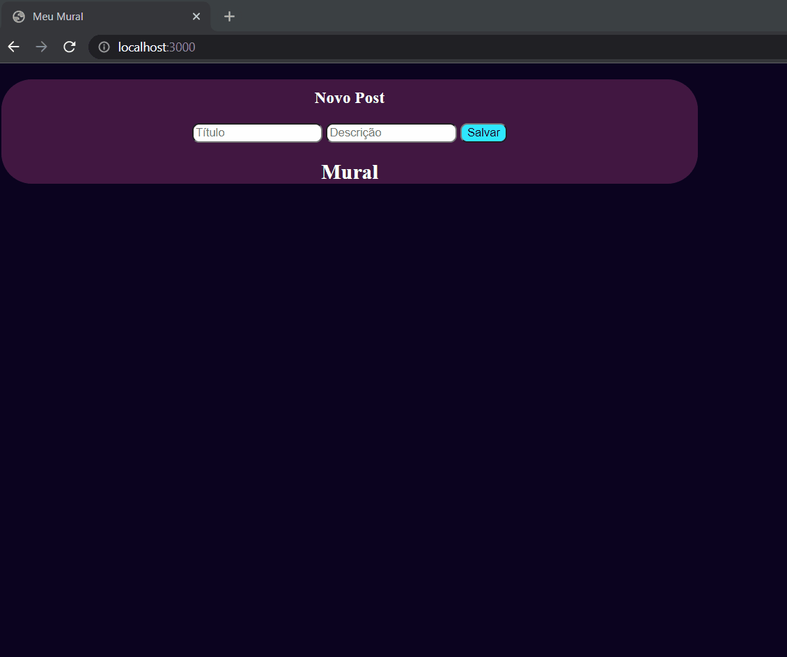

# Mural de Avisos

### Pequeno projeto criado a partir do curso <a url="https://programadorbr.com/">ProgramadorBr</a> para pôr em prática o conhecimento em Node.js, integrando o front com o back através de uma API Rest.  
#### Este projeto é um mural de avisos que envia o título e a descrição para ficar salva no back-end, e assim, retorna toda a lista salva na mesma página.
 
#

#

  

